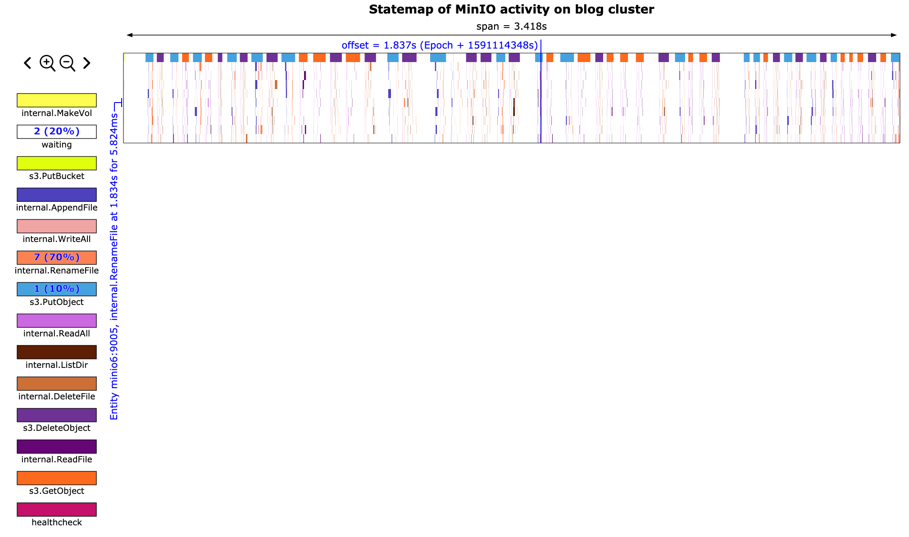
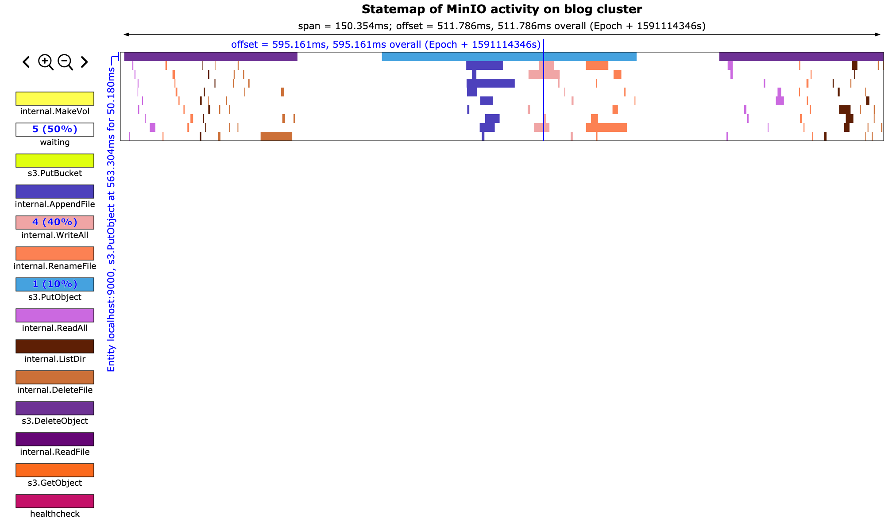

# Tracing MinIO and rust-statemap
#### 2020-06-02

MinIO is a neat little program. I initially thought that MinIO was just a broker
that could provide an S3 API to front another object storage system.
However, MinIO can do a lot more than this.

There are currently two interesting modes of operation for MinIO. The first is
as a gateway, which acts like I described previously. It layers an S3 API on top
of another object storage system. The 'backend' system could be Manta, Google
Cloud Storage, Azure Blob Storage, S3 itself, or any other system. You could
even implement a WebDAV backend or local filesystem backend if you wanted to.

The second interesting mode of operation has MinIO act as a distributed object
storage system. MinIO itself is the backend storage in this model. MinIO can use
erasure coding to store files in a durable and inexpensive manner across
multiple machines, possibly in different availability zones.

We were considering using MinIO as the storage tier for Manta to reduce the cost
of storing data while maintaining acceptable durability characteristics. This
would have been an alternative to an iSCSI + ZFS layered architecture. Details
are described in
[RFD-181](https://github.com/joyent/rfd/blob/master/rfd/0181/README.md).
Other software companies also use MinIO as part of their larger object
storage systems. Nutanix is one of the more recent groups to announce they are
using MinIO in their system.

Although we ended up not choosing to pursue MinIO we did learn a lot about it
along the way. We also wrote and extended a couple pretty cool tools to help
us use MinIO. I'll describe these here.

### Chum

I wrote about
[manta-chum in the past](https://blog.kkantor.com/2020/storage_tier_improvements).
It's a tool that we wrote to test the Manta storage
tier when we found existing tools like fio and COSbench were insufficient.

We extended manta-chum to support the S3 protocol. Unfortunately the S3 protocol
is heavy even from the perspective of a client, so we chose to use a heavy Rust
AWS API library rather than writing our own minimal client.

Using manta-chum with MinIO allowed us to use the same tool to benchmark all of
our possible storage tier configurations using the same software. This is really
important to us so that we know that the load gen tool is following the same
logic across all target configurations. Plus, manta-chum has tabular output and
we already had a number of gnuplot knowledge we could transfer from the local
filesystem and WebDAV testing we performed earlier.

The new mode can be invoked like this:

```
$ ./chum -t s3:localhost -w r,w,d -s 10
```

See the repo for more information.

### MinIO trace data

When we started looking at MinIO we found some performance problems. Latency was
high and we weren't sure why. We were wondering what each MinIO instance was
doing at any given time. Luckily we discovered MinIO's tracing utilities.

MinIO has a pretty nice distributed tracing facility built-in. Although the data
is nice, it's impossible to consume without additional tools. Here's what the
data looks like, in JSON form:

```
$ mc admin trace -a --json min0 | tee my_trace
[...]
{
 "host": "localhost:9000",
 "time": "2020-06-02T16:12:29.745192997Z",
 "client": "172.19.0.1",
 "callStats": {
  "rx": 262234,
  "tx": 263,
  "duration": 39692427,
  "timeToFirstByte": 0
 },
 "api": "s3.PutObject",
 "path": "/chum/v2/chum/ae/ae8ae9bf-9785-4fdf-bb62-abdd7e60f377",
 "query": "",
 "statusCode": 200,
 "statusMsg": "OK"
}
```

That snippet shows a top-level operation, `s3.PutObject`. We also get
trace data for each individual internal cluster API operation, like when one
node tells another node to create or delete a file.

### minio-statemap

I really enjoy using the statemap tool that Bryan wrote when he was at Joyent.
We decided to write some software to convert the MinIO trace data to the
statemap input format so we can generate statemaps of a MinIO cluster. This
seemed like pretty novel stuff at the time since to date most of our statemap
data sources have been DTrace scripts.

[minio-statemap](https://github.com/joyent/minio-statemap) was born!
This tool takes the above trace data and converts it into per-node states that
look like this:

```
$ ./minio-statemap -i ./my_trace -c "blog cluster" > minio_states
[...]
{"time":"147181850","entity":"localhost:9000","state":10,"tag":null}
```

Creating statemap metadata and ensuring an entity doesn't 'go back in time' is
also handled.

Now we can generate a statemap using the usual statemap workflow:

```
$ statemap minio_states > minio.svg
```

### rust-statemap

After hacking together minio-statemap it was abundantly clear that we needed a
convenient wrapper for the statemap API. Manually setting up statemap
structs and ensuring all of the statemap rules were followed was very messy.

We wrote a rust module that helps developers create statemaps. This can be used
out-of-band like we did with minio-statemap, or in the hot path. We use the
hot-path method in manta-chum, which I may write about later.

Regardless, [rust-statemap](https://github.com/kodykantor/rust-statemap) was
built to provide a simple API for creating statemaps. In my opinion
this should be moved into the statemap repository instead of being maintained
as a separate tool. Some explanation of my thoughts on this are at the end
of the README.

After we had rust-statemap we were able to refactor minio-statemap to remove
all of this confusing logic.

### Results

At the end of the day we get a statemap that looks like this:



We can zoom in and see the exact internal API calls that make up each top-level
API call. This will also show us how long each API call takes and how much time
is wasted between calls.



This tool has been incredibly helpful for us. Using minio-statemap we were able
to trim out a lot of unnecessary work from the extremely chatty MinIO protocol.

A full MinIO statemap SVG can be found in the [minio-statemap repository](https://github.com/joyent/minio-statemap/tree/master/examples).
